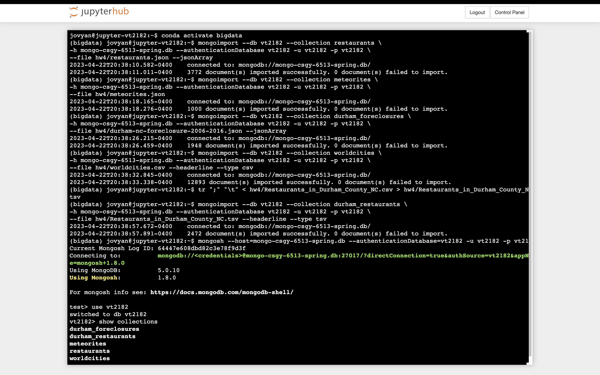

# Homework 4

## Q0. Load all datasets into MongoDB

```bash
# restaurants
mongoimport --db vt2182 --collection restaurants \
-h mongo-csgy-6513-spring.db --authenticationDatabase vt2182 -u vt2182 -p vt2182 \
--file restaurants.json --jsonArray

# durham_restaurants
tr ";" "\t" < Restaurants_in_Durham_County_NC.csv > Restaurants_in_Durham_County_NC.tsv

mongoimport --db vt2182 --collection durham_restaurants \
-h mongo-csgy-6513-spring.db --authenticationDatabase vt2182 -u vt2182 -p vt2182 \
--file Restaurants_in_Durham_County_NC.tsv --headerline --type tsv

# durham_foreclosures
mongoimport --db vt2182 --collection durham_foreclosures \
-h mongo-csgy-6513-spring.db --authenticationDatabase vt2182 -u vt2182 -p vt2182 \
--file durham-nc-foreclosure-2006-2016.json --jsonArray

# meteorites
mongoimport --db vt2182 --collection meteorites \
-h mongo-csgy-6513-spring.db --authenticationDatabase vt2182 -u vt2182 -p vt2182 \
--file meteorites.json

# worldcities
mongoimport --db vt2182 --collection worldcities \
-h mongo-csgy-6513-spring.db --authenticationDatabase vt2182 -u vt2182 -p vt2182 \
--file worldcities.csv --headerline --type csv
```

```bash
mongosh --host mongo-csgy-6513-spring.db --authenticationDatabase vt2182 -u vt2182 -p vt2182

vt2182> use vt2182

vt2182> show collections
durham_foreclosures
durham_restaurants
meteorites
restaurants
worldcities

vt2182> db.restaurants.count()
3772
```



## Q1. Write MongoDB queries for

Datasets: [`restaurants.json`](./restaurants.json)

1. Count the number of documents in the collection.
2. Display all the documents in the collection.
3. Display: restaurant_id, name, borough and cuisine for all the documents.
4. Display: restaurant_id, name, borough and cuisine, but exclude field _id, for all the documents in the collection.
5. Display: restaurant_id, name, borough and zip code, exclude the field _id for all the documents in the collection.
6. Display all the restaurants in the Bronx.
7. Display the first 5 restaurants in the Bronx.
8. Display the second 5 restaurants (skipping the first 5) in the Bronx.
9. Find the restaurants with a score more than 85.
10. Find the restaurants that achieved a score, in between 80 and 100.
11. Find the restaurants which locate in [lat,lon] where latitude <= -95.75 and longitude <= -73.90.
12. Find the restaurants that do not prepare any cuisine of 'American' and their grade score more than 70 and longitude less than -65.754168.
13. Find the restaurants which do not prepare any cuisine of 'American' and achieved a score more than 70 and located in the longitude less than -65.754168. (without using $and operator).
14. Find the restaurants which do not prepare any cuisine of 'American ' and achieved a grade point 'A'  and not in the borough of Brooklyn, sorted by cuisine in descending order.
15. Find the restaurant Id, name, borough and cuisine for those restaurants which contain 'Wil' as first three letters for its name.
16. Find the restaurant Id, name, borough and cuisine for those restaurants which contain 'ces' as last three letters for its name.
17. Find the restaurant Id, name, borough and cuisine for those restaurants which contain 'Reg' as three letters somewhere in its name.
18. Find the restaurants which belong to the borough Bronx and prepared either American or Chinese dish.
19. Find the restaurant Id, name, borough and cuisine for those restaurants which belong to the boroughs of Staten Island or Queens or Bronx or Brooklyn.
20. Find the restaurant Id, name, borough and cuisine for those restaurants which are not belonging to the borough Staten Island or Queens or Bronx or Brooklyn.
21. Find the restaurant Id, name, borough and cuisine for those restaurants which achieved a score below 10.
22. Find the restaurant Id, name, borough and cuisine for those restaurants which prepared dish except 'American' and 'Chinese' or restaurant's name begins with letter 'Wil'.
23. Find the restaurant Id, name, and grades for those restaurants which achieved a grade of "A" and scored 11 on an ISODate "2014-08-11T00:00:00Z" among many of survey dates.
24. Find the restaurant Id, name and grades for those restaurants where the 2nd element of grades array contains a grade of "A" and score 9 on an ISODate "2014-08-11T00:00:00Z".
25. Find the restaurant Id, name, address and geographical location for those restaurants where 2nd element of coordinates contains a value which is more than 42 and up to 52.

## Q2. Restaurant foreclosures in North Carolina

Some Background: geospatial logic is possible in MongoDB using the geopastial library/facilities. https://docs.mongodb.com/manual/geospatial-queries/

Datasets:
- [`durham-nc-foreclosure-2006-2016.json`](./durham-nc-foreclosure-2006-2016.json)
- [`Restaurants_in_Durham_County_NC.csv`](./Restaurants_in_Durham_County_NC.csv)

Find the number of foreclosures within the _polygon_ defined as all restaurants where `Rpt_Area_Desc=”Food Service”` and `Seats>=100`.

## Q3. Extra Credit

Datasets:
- [`meteorites.json`](./meteorites.json)
- [`worldcities.csv`](./worldcities.csv)

Use the MongoDB geospatial facilities to *find the nearest city to each meteorite “fallen” (not found) since the year 1950, inclusive*. Distance is between coordinates should be a straight line. 

Note: 
- `worldcities` is a CSV file. You will need to import into MongoDB AND clean-up the double quotes.
- Use the `$near` operator and select this closest entry per city.

---

# Solutions

## Q1

[q1.js](./q1.js)

```bash
mongosh --host mongo-csgy-6513-spring.db --authenticationDatabase vt2182 -u vt2182 -p vt2182 < q1.js
```

[q1.ipynb](./q1.ipynb)

## Q2, Q3

[q23.ipynb](./q23.ipynb)

https://csgy-6513-spring.rcnyu.org/
